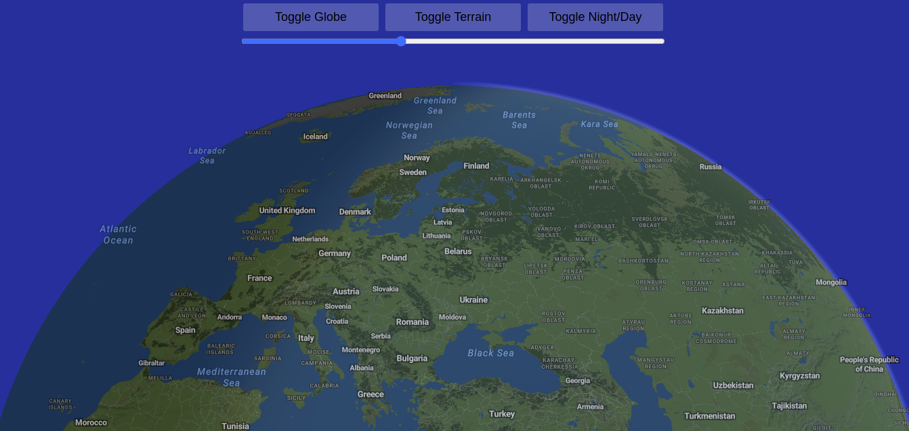
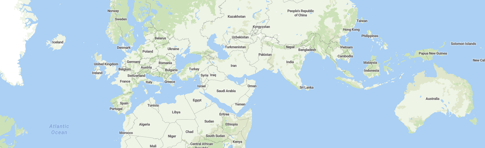
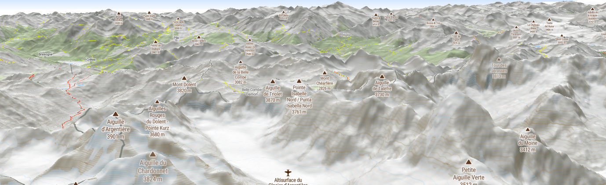
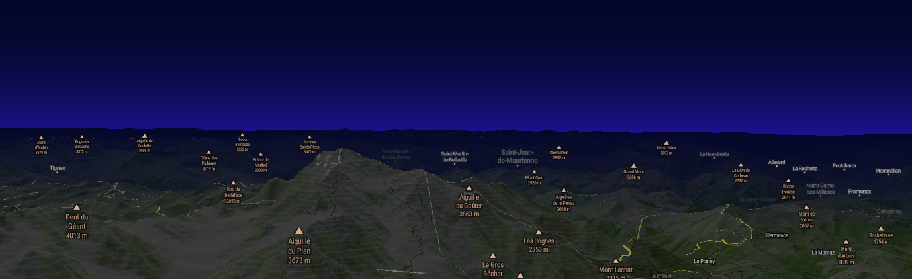
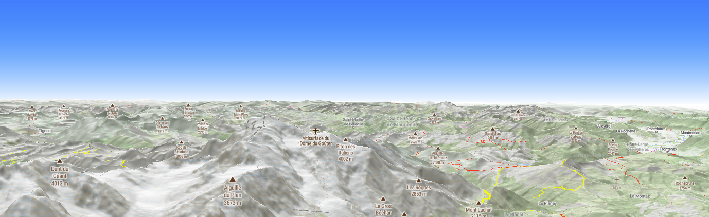
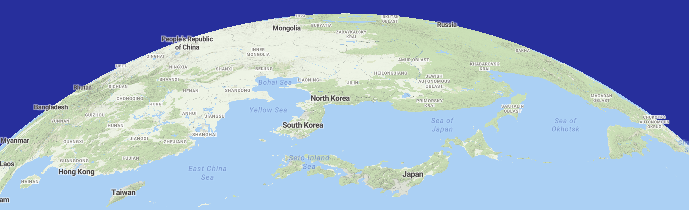
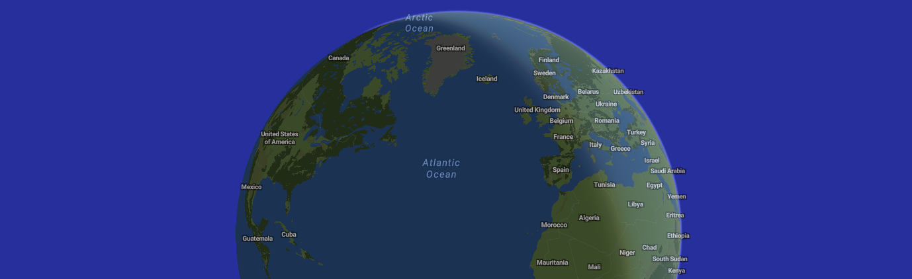
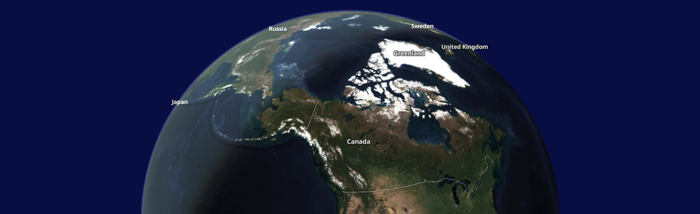

# Maplibre Fun Globe

Since `v5`, Maplibre is able to display a globe and not only a square-shaped Mercator map. The good thing (sort of) is that it still feed on Mercator tiles, so no need to change the data provider.

## This demo project
This project was initialized with the following Vite scaffolding command:
```bash
npm create vite@latest maplibre-fun-globe -- --template vanilla-ts
```

There are quite a lot of comments in the file `src/main.ts` to explain how things are set up.

To keep things minimalistic, this project is not using any frontend framework, just vanilla TS.

## Run it locally
This demo is using vector tiles distributed by MapTiler, which can be used for free. Rename the `.env.sample` into `.env` and set your MapTiler Cloud API key inthere.

Then in a term:

```bash
npm install
npm run dev
```

And open your browser at the URL (localhost) printed in the terminal

## Implementation details
### 🗺️ Adding a map:

```ts
// Importing Maplibre + style
import {Map as MLMap} from "maplibre-gl";
import "maplibre-gl/dist/maplibre-gl.css";

// ...

const map = new MLMap({
  // ID of a div
  container: "map-container",
  
  // URL to a style.json
  style: `https://api.maptiler.com/maps/outdoor-v2/style.json?key=${import.meta.env.VITE_MAPTILER_API_KEY}`,
  
  // Keeps location in URL hash for next page refresh
  hash: true, 

  // To go lower and better see the horizon line than with the default (60)
  maxPitch: 85,
});
```
### The most important event
Wait for the `load` event before doing (almost) anything:
```ts
map.on("load", () => {
  // Do things that require the style and sprites to be loaded
  // and map to be internaly initialized.
});
```

### 🏔️ Terrain

Bump some terrain from a terrain RGB tile source:
```ts
const terrainSourceId = "maptiler-terrain-source";

// Add a data "source" of type "raster-dem":
map.addSource(terrainSourceId, {
  type: "raster-dem",
  url: `https://api.maptiler.com/tiles/terrain-rgb-v2/tiles.json?key=${import.meta.env.VITE_MAPTILER_API_KEY}`,
});

// Bump it:
map.setTerrain({
  source: terrainSourceId,
  exaggeration: 1, // a factor applied to the terrain
});
```

Later on update the terrain exaggeration, for instance to create growing terrain animation:
```ts
map.terrain.exaggeration = 2;

// Forces a re-render of the map:
map.triggerRepaint();
```

We can also remove the terrain:
```ts
// Map going flat again:
map.setTerrain(null);

// Remove the source so that the the tiles stop to be fetched under the hood:
map.removeSource(terrainSourceId);
```

### 🌆 Sky and fog 🌁




This consists setting three colors: **sky**, **horizon** and **fog**, as well as blending factors.
```ts
map.setSky({
  // color of the sky. Bright blue here.
  "sky-color": '#037ffc',
  
  // in [0, 1], with:
  // 0 all the sky is of "sky-color", with no gradient
  // 1 very long gradient above the horizon line 
  //        between "horizon-color" (close to horizon) and "sky-color" high up in the sky
  "sky-horizon-blend": 0.5,
  
  // Color of the horizon. Depending on the blending factors, this color will
  // difuse to the fog (towards camera) and/or to the sky (high up, only visible with low point of view)
  "horizon-color": "#ffffff",

  // in [0, 1], with:
  // 0 "horizon-color" diffuses a lot towards the camera to fog/ground,
  //   especially if "fog-ground-blend" is close to 1.
  // 1 the "horizon-color" does not diffuse at all to the fog/ground
  "horizon-fog-blend": 0.8,

  // Color of the fog. The fog goes from the horizon line towards the camera
  "fog-color": "#ffffff",

  // in [0, 1], with 
  // 0 covering a long distance from the horizon line towards the camera
  // 1 basically no fog (not going any further than horizon line).
  // If close to 1, the "fog-color" will hardly be present and instead 
  // "horizon-color" will take precedence
  "fog-ground-blend": 0.9,

  // On daylight mode, we remove the atmosphere entirely
  "atmosphere-blend": 0
});
```

The blending factors and colors can be fixed (like above) or **expressions** that interpolate based on different factors (generaly the zoom level) to create more dynamic visuals.

##Note:## This is not working in globe mode 🙁 (yet)

### 🌐 Globe mode


There are two projections: Mercator (the default) and globe. To enable the globe:

```ts
map.setProjection({
  type: "globe",
});
```

And to go back to Mercator:
```ts
map.setProjection({
  type: "mercator",
});
```

### 🌅 Atmosphere haze and light


It's possible to enable some light on the globe (not working on Mercator)
```ts
map.setSky({
  // These we've seen already
  "sky-color": '#00092b',
  "sky-horizon-blend": 0.4,
  "horizon-color": "#001d91",
  "horizon-fog-blend": 0.999,
  "fog-color": "#00092b",
  "fog-ground-blend": 0.,

  // The atmosphere blend can be a number in [0, 1]
  // where 0 hides the atm entirely and 1 makes it very visible.
  // A nice thing to do is to make it an expression that depends on
  // the zoom level, so that the atm fades out and doesn't get too much in the 
  // way as we zoom in. Just like below:
  "atmosphere-blend": [
    "interpolate", // means we interpolate...
    ["linear"], // .. linearly ...
    ["zoom"], // ... based on the zoom level. And then its a values 2 by 2:

    0,   // at zoom level 0 (from afar)...
    0.6, // the atm blending value is 0.6

    3,   // as we zoom up to z3...
    0.3, // the atm blending value shrinks to 3, so it's fading

    4.5, // and finaly, when zooming up to z4.5 (and closer)...
    0    // the atm becomes totally invisible

    // note that we could have more steps here, but for this demo, 3 is enough.
  ]
});
```
This works also pretty well with hybrid images:
```ts
map.setStyle(`https://api.maptiler.com/maps/hybrid/style.json?key=${import.meta.env.VITE_MAPTILER_API_KEY}`);

```


