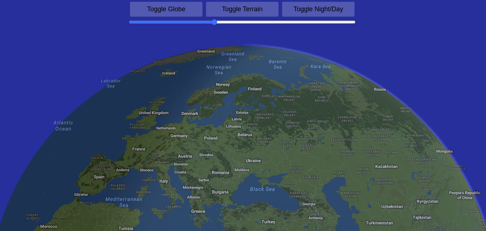

# Maplibre Fun Globe

Since `v5`, Maplibre is able to display a globe and not only a square-shaped Mercator map. The good thing (sort of) is that it still feed on Mercator tiles, so no need to change the data provider.

## This demo project
This project was initialized with the following Vite scaffolding command:
```bash
npm create vite@latest maplibre-fun-globe -- --template vanilla-ts
```

There are quite a lot of comments in the file `src/main.ts` to explain how things are set up.

To keep things minimalistic, this project is not using any frontend framework, just vanilla TS.

## Run it locally
This demo is using vector tiles distributed by MapTiler, which can be used for free. Rename the `.env.sample` into `.env` and set your MapTiler Cloud API key inthere.

Then in a term:

```bash
npm install
npm run dev
```

And open your browser at the URL (localhost) printed in the terminal

